# Example Report 1 - Week of 09/05/2023 (Week 2)
## Jeff Lubow, Technology Design Foundations

### Summary: 

This week, I utilized the TDF Computational Design project files to evaluate a phone stand for my own documentation in the course.
The result was that I cut it out to make sure that it fit my phone.  I had some concerns about it fitting, so I measured a few times beforehand.  I made it with laser-cut acrylic and it came out nicely.  

Some information about my process:
I spent time in Rhino3d and was able to generate a multitude of different files for phones other than my own.  I experimented with form factors and thought a lot about whether other phones would work within this procedurally generated design.  

I did some initial sketching here:

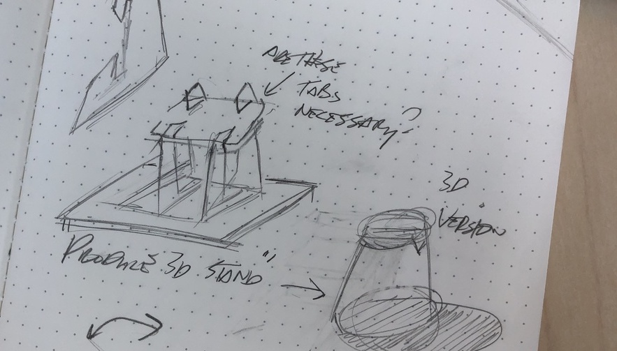</img> 
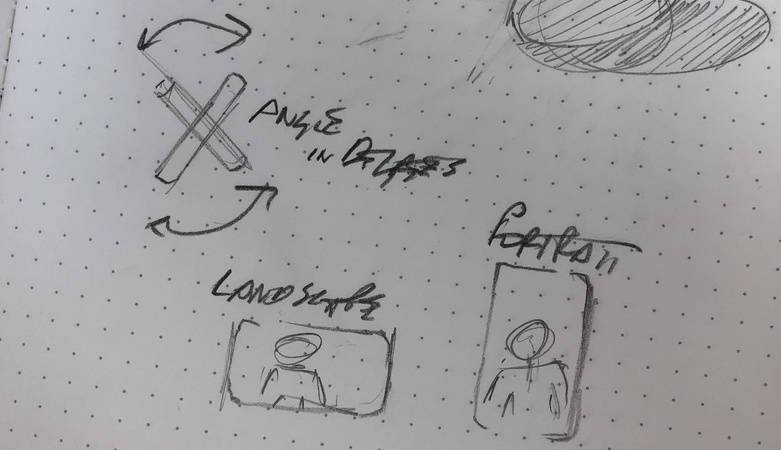</img>

Here is a link to some video documentation I made of my cell phone stand getting cut at Jacobs!  :)
I did have some issues with heat level, which I brought up to one of my instructors.

<a href="https://www.youtube.com/watch?v=FoVW6_42l34"></img></a>

---

### Reflections:

Initially I broke out the measuring tools that came to mind.

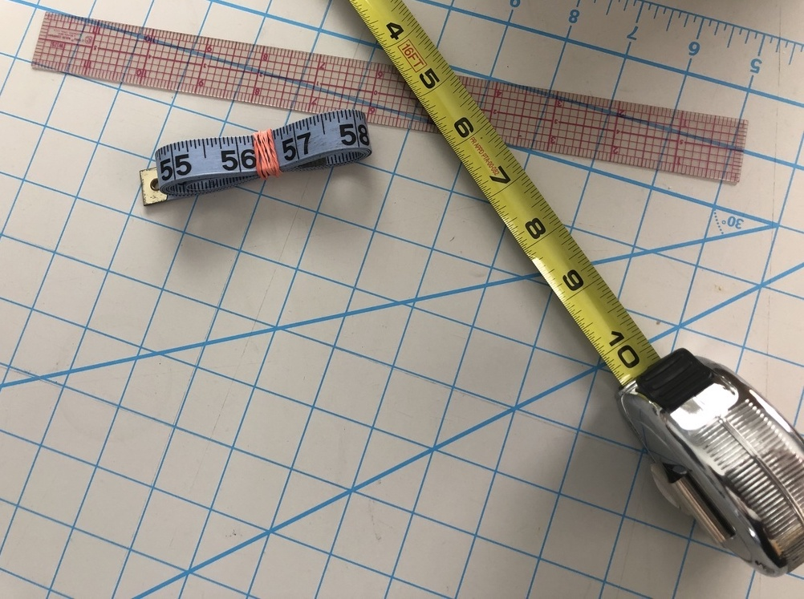

I took measurements of my phone and realized that I was measuring in inches, but that the file requires millimeters.  I measured again and it worked out well.
I eventually ended up using digital calipers that I found in the Makerspace, because I didn't feel like a standard ruler was accurate enough.

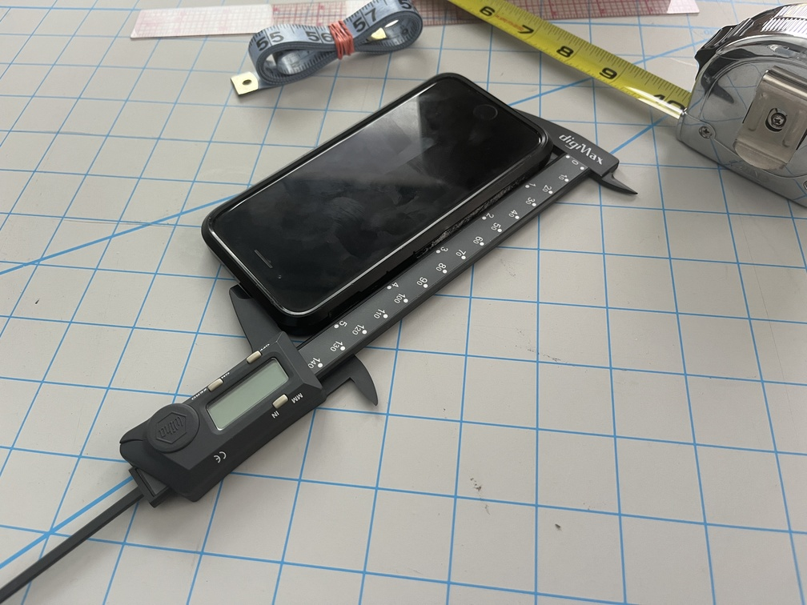 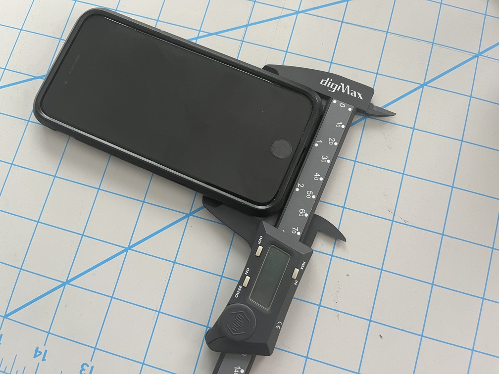

I was able to locate the UI grasshopper panel by navigating in Rhino3d to the "panels" pane and selecting the grasshopper icon.  I found that I needed to disable it from view before re-enabling.

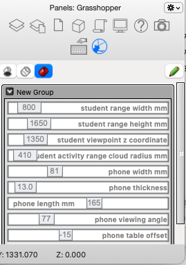

Here are some shots of my explorations of the CellPhoneStand file:

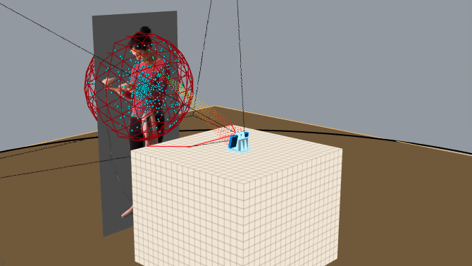
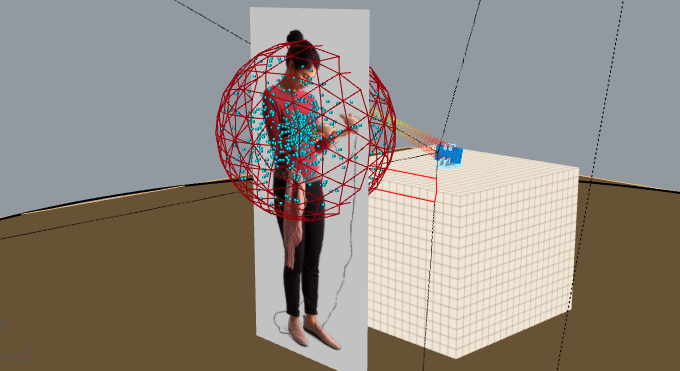
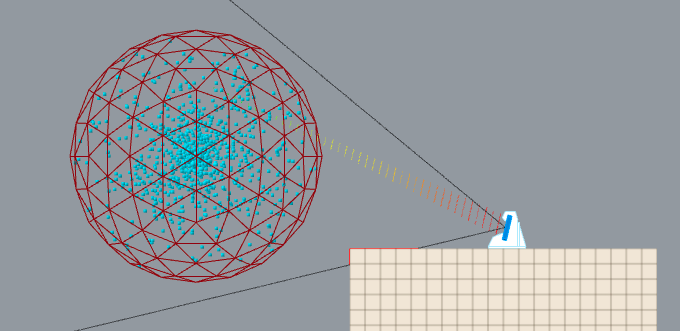
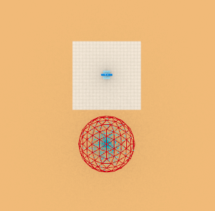
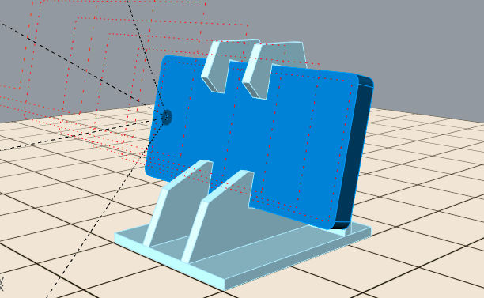
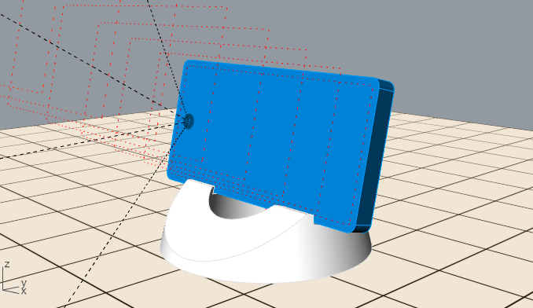
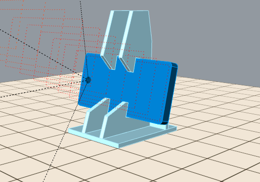
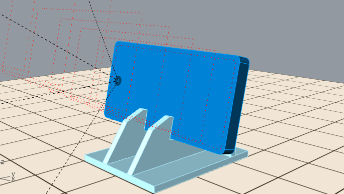
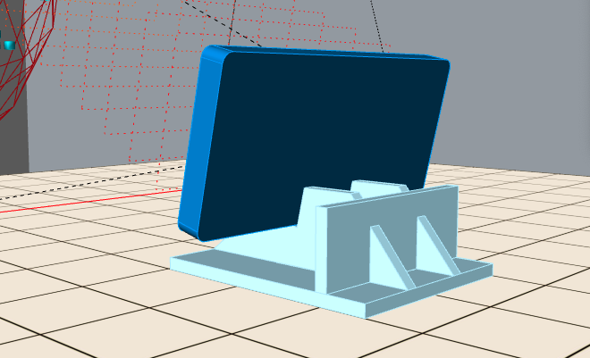

I spent some evaluating the `CellPhoneStand_forGrasshopper` files and had a few realizations:

1. The .stl file is a product of the parameters in the Grasshopper UI, and needs to be exported
2. The model shown in the display is a specific height, but I need not worry about that because I'm overriding this when I enter in new data into the UI Grasshopper panel
3. The point cloud representing the field of view is not calculated on the fly, but is a demonstrable as to what sort of considerations a designer would need to be taking into account when 

---

### Speculations:

I think that in the upcoming weeks, I want to use this stand for video/still documentation of the work I do.  It will hopefully make my weekly reports easier in the sense that I can manipulate whatever physical objects I am working with during the video recording.  I suspect the faculty of TDF may ask me to make an introductory video about myself in which I discuss the reasons I'm here in the program.  It seems that there was an invitation to have this conversation in the TDF slack channel

---
