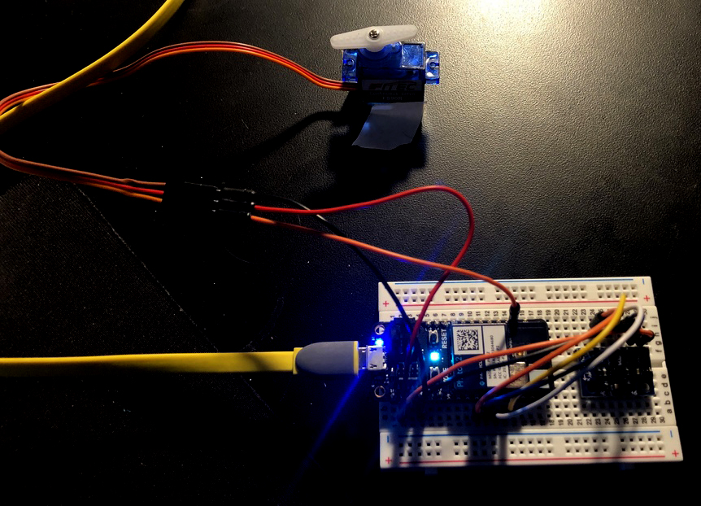
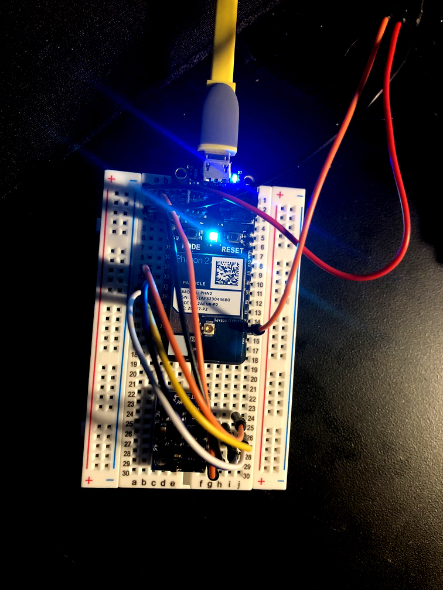
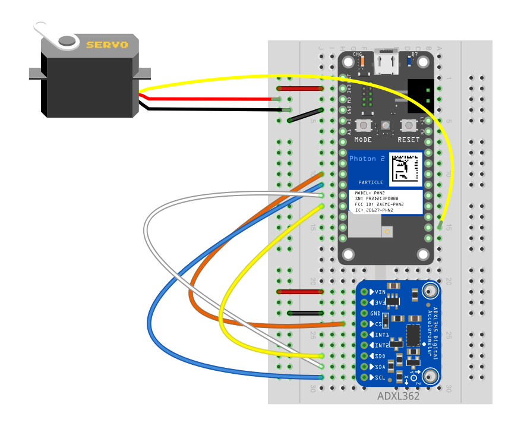
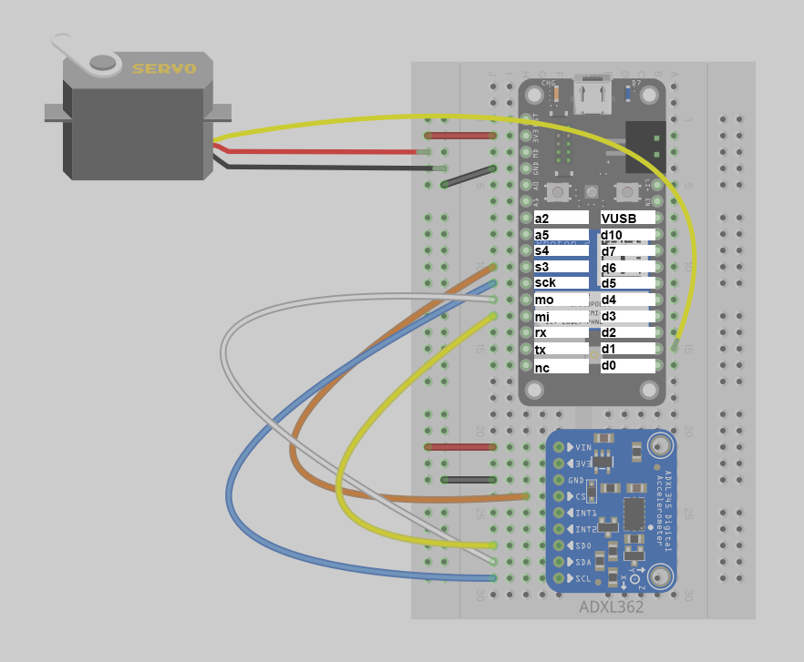

## Accelerometer -> Servo Example

A Particle Workbench Project demonstrating how to process an accelerometer's input to yield output in a servo motor.  

<div align="center">
</img>
</div>

## Table of Contents
- [Goal of project](#goal)
- [Hook-up Diagram](#diagram)
- [Steps to recreate the circuit](#steps-circuit)
- [Steps to recreate the software environment](#steps-software)
- [Code](#code)
- [Usage](#usage)

---

<a name="goal"></a>
### Goal of Project 

*Use a value from an accelerometer to change the behavior of a servo motor.*

We will use a [ADXL362](https://www.analog.com/en/products/adxl362.html) accelerometer breakout board to input rotational data into the Photon2 for processing, use a portion of this data stream for processing, and pass the data to an output pin, which will control an [FS90R](https://www.adafruit.com/product/2442) servo motor's speed and direction, depending on the orientation of the accelerometer.  Because both devices operate on 3.3V of power, we won't need any supporting components other than the leads from the componenets to the board.

#### This project demonstrates the following:

1. how to write code with the "Device OS" Particle.io operating system (microcontroller-based) that takes input, processes it, and passes the processed data to an output to yield actuation
1. how to connect a servo component, an accelerometer, and your photon2 microcontroller together via a breadboard with leads.  
1. how to use the DeviceOS's included Servo library
1. how to include a library that is located in the Particle.io system cloud

---

<a name="diagram"></a>
### Hook-up Diagram: 

The circuit is powered over 3.3V from the microcontroller, which can be supplied via a usb power adapter, a lipo battery, or your computer's usb port.

accel-to-servo top | accel-to-servo fritzing
---|---
 | 

<div align="center">
  <br>
  
  <p>pinout detail</p>
</div>


<a name="steps-circuit"></a>
### Steps to recreate circuit:

**Photon 2 connections:**

1. push your Photon 2's pins into a mini (or regular) breadboard so that it straddles the two sides.  Note that one of the sides will have more pins left on the relevant rails than the other.  This is fine.  Also note that if you position the device towards the top of the board it's easier to plug in the micro-USB cable.  
1. connect a lead from the 3.3V pin of the photon2 to the red rail on your breadboard
1. connect a lead from the GND pin on the photon2 to the ground rail on your breadboard (blue or black)

**Servo (FS90R) connections:**

1. connect a lead from the red socket of the servo female connector to the 3.3V rail on your breadboard 
1. connect a lead from the brown socket of the female connector to the ground rail on your breadboard 
1. connect a lead from the orange socket of the female connector to the rail on your breadboard that connects to the D1 digital pin (note that not all pins offer PWM so we are choosing this one specifically, but feel free to use a similarly compatible pin, knowing that you'd have to alter this in the code).

**Accelerometer (ADXL362) connections:**

1. connect a lead from the ADXL362's VIN to the 3.3V rail on your breadboard
1. connect the ADXL362's GND (ground) to the GND rail on your breadboard
1. connect the ADXL362's SCL (SPI clock) to the photon2's SCK pin
1. connect the ADXL362's SDA (bidirectional data pin) to the photon2's MO/MOSI pin
1. connect the ADXL362's SDO (serial data out) to the photon2's MI/MISO pin 
1. connect the ADXL362's CS (chip select) to the photon2's S3/SPI-SS pin

**Note:** some of the pins that are referred to in these steps have special purposes depending on the application.  Please refer to the [Photon 2 pin marking diagram](https://docs.particle.io/reference/datasheets/wi-fi/photon-2-datasheet/#pin-markings) located in the [photon 2 datasheet](https://docs.particle.io/reference/datasheets/wi-fi/photon-2-datasheet/) page on the [Particle.io reference](https://docs.particle.io/reference/) website for more information.  For this demonstration we do not manipulate pin configurations directly in the `setup()` function of the code.

---

<a name="steps-software"></a>
### Steps to replicate software environment

**Note:** *We assume that you have installed Particle Workbench inside of Visual Studio Code, and are familiar with the process of selecting your device.*  If not, see [this tutorial](https://github.com/Berkeley-MDes/tdf-fa24-equilet/blob/main/_tutorials/installation_compilation/p2_pw_tutorial/README.md).

1. open the folder this README resides within in Visual Studio Code
1. bring up the command palette with `⇧⌃P (Windows, Linux) | ⇧⌘P (macOS)` 
1. type `>Particle: Configure Project for Device`, and hit `enter`
1. verify/compile
1. flash the code to your photon2 

<a name="code"></a>
#### Code (represented in project):

```
#include "ADXL362.h"
SYSTEM_THREAD(ENABLED);

ADXL362 adxl362;
Servo serv;

int servoPin = D1;
int pos = 0;

void setup() {
  Serial.begin(9600);
  Serial.println("Started");
  adxl362.begin(SS);
  adxl362.beginMeasure();
  serv.attach(servoPin);
}

void loop() {
  int16_t x, y, z, temp;
  adxl362.readXYZTData(x, y, z, temp);
  pos = map(x, -1200, 1200, 0, 180);
  serv.write(pos);
  Serial.printf("x: %d y: %d z: %d\n", x, y, z);
  Serial.printf("position: %d\n", pos);
  delay(1500);
  serv.write(90);
  delay(1500);
}

```

---

<a name="usage"></a>
### To use

1. move the breadboard around the x axis 
2. different orientations will yield particular speeds of the servo motion when it is in the "on" stage of the loop