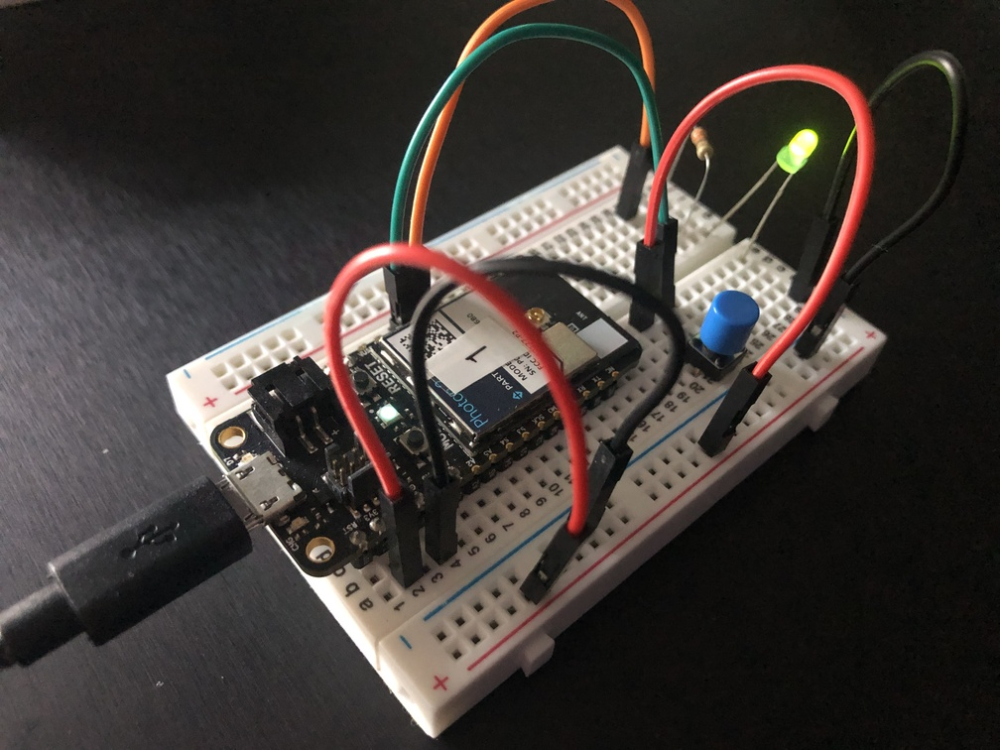
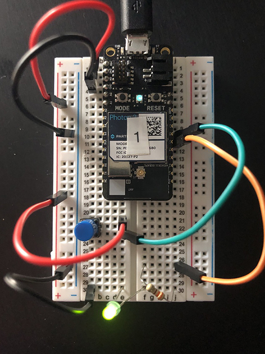
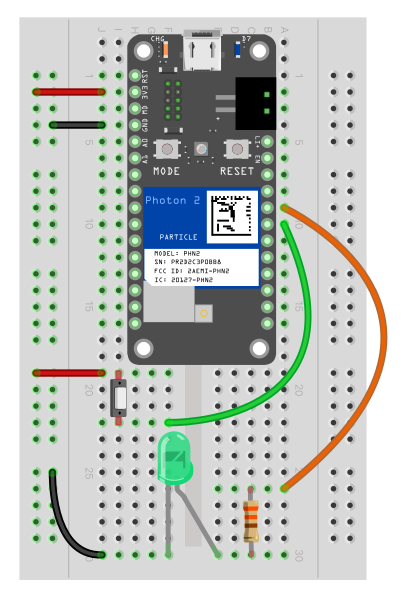

## Button -> LED Pulse rate



## Table of Contents
- [Goal of project](#goal)
- [Hook-up Diagram](#diagram)
- [Steps to recreate the circuit](#steps-circuit)
- [Steps to recreate the software environment](#steps-software)
- [Code](#code)
- [Usage](#usage)

---

<a name="goal"></a>
### Goal of Project 

*Press a button (momentary switch) multiple times to alter how quickly an LED is flashing*

We will use some standard components to perform this exercise.  The action of you pressing a button will alter a variable in the code running on the microcontroller, which will in turn change how rapidly the LED flashes.  This is accomplished via what is called an "interrupt function".  Not all pins can operate as interrupts, so we'll choose our pins for i/o carefully.  Refer to the [Photon 2 pin marking diagram](https://docs.particle.io/reference/datasheets/wi-fi/photon-2-datasheet/#pin-markings) located in the [photon 2 datasheet](https://docs.particle.io/reference/datasheets/wi-fi/photon-2-datasheet/) page on the [Particle.io reference](https://docs.particle.io/reference/) website.  We'll also use a couple of resistors for the LED and one of the button's legs.

#### This project demonstrates the following:

1. how to write code with the "Device OS" Particle.io operating system (microcontroller-based) that takes input, processes it, and passes the processed data to an output to yield actuation
1. how to connect an LED component, a button component, and your photon2 microcontroller together via a breadboard with leads.  
1. how to use DeviceOS's `attachInterrupt()` function

---

<a name="diagram"></a>
### Hook-up Diagram: 

The circuit is powered over 3.3V from the microcontroller, which can be supplied via a usb power adapter, a lipo battery, or your computer's usb port.

button/led top | button/led fritzing
---|---
 | 

### A note on LEDs:

For an overview of LEDs at large, see [this video](https://www.youtube.com/watch?v=O8M2z2hIbag&ab_channel=TheEngineeringMindset).

There are pull-up and pull-down resistors on the microcontroller.  You can read about that [here](https://learn.sparkfun.com/tutorials/pull-up-resistors/all), as well as watching [this video](https://youtu.be/wxjerCHCEMg?t=124
) for an illustration.

We use a resistor value other than what is available on the microcontroller, because choosing the value gives us control over how dim we want the on-state of the LED (and not be subject to the value on the board).  We are using a 330 ohm resistor.  If you do not have this exact value in your kit, fear not:  Rather than thinking too much about which value you have versus this diagram, consider how a high resistance will make the LED dimmer, and low resistance will produce brighter illumination.  The LED is perfectly fine without any resistor at all.  The typical limit for how much voltage can be applied to the LED is around 12.5V, and the output of the GPIO pin D5 is 3.3V.  

### A note on resistors:

We put the resistor in line with the LED's longer lead, which is the positive side and referred to as the "anode".  The negative, shorter leg is the "cathode".
read more about the reasoning behind, and theory of that here:  
https://learn.sparkfun.com/tutorials/light-emitting-diodes-leds/all   

---

<a name="steps-circuit"></a>
### Steps to recreate circuit:

**Photon connections:**

1. push your Photon 2's pins into a mini (or regular) breadboard so that it straddles the two sides.  **Note** that one of the sides will have more pins left on the relevant rails than the other.  This is fine.  Also **note** that if you position the device towards the top of the board it's easier to plug in the micro-USB cable.  
1. connect a lead from the 3.3V pin of the photon 2 to the +V (red) rail of your breadboard
1. connect a lead from the GND pin of the photon 2 to the GND (blue) rail of your breadboard

**Button connections:** 

1. connect a lead from the +V rail to a rail touching the top (see diagram) leg of the button
1. connect a lead from the a rail touching the bottom leg of the button to pin D6

**Note:** *You may try clipping the button leads a bit shorter to get it flush with the breadboard so that it is more stable.*

**LED connections:**

1. connect a lead from the GND rail to a rail touching the shorter leg of an LED.
1. connect the long leg of the LED to a rail touching the resistor
1. connect the other lead of the resistor to an open rail
1. connect from that rail to pin D5 of your Photon2

See [diagram](#diagram) for more information...

---

<a name="steps-software"></a>
### Steps to replicate software environment

**Note:** *We assume that you have installed Particle Workbench inside of Visual Studio Code, and are familiar with the process of selecting your device.*  If not, see [this tutorial](https://github.com/Berkeley-MDes/tdf-fa24-equilet/blob/main/_tutorials/installation_compilation/p2_pw_tutorial/README.md).

1. open the folder this README resides within in Visual Studio Code
1. bring up the command palette with `⇧⌃P (Windows, Linux) | ⇧⌘P (macOS)` 
1. type `>Particle: Configure Project for Device`, and hit `enter`
1. verify/compile
1. flash the code to your `Photon2` 

<a name="code"></a>
#### Code (represented in project):

```
#include "Particle.h"
SYSTEM_MODE(AUTOMATIC);
SYSTEM_THREAD(ENABLED);
SerialLogHandler logHandler(LOG_LEVEL_INFO);

void buttonPressed();

const int ledPin = D5; // the pin that the LED is attached to
const int buttonPin = D6; // this pin can be used as an interrupt pin
int pulserate = 900; // variable to store the read value
bool buttonval = false;

void setup() {
  interrupts(); //enable interrupts
  pinMode(ledPin, OUTPUT); // initialize the LED pin as an output:
  pinMode(buttonPin, INPUT_PULLDOWN); // initialize the pushbutton pin as an input:
  attachInterrupt(buttonPin, buttonPressed, RISING); //attach an interrupt to the button pin, based on the rising edge
}

void loop() {
  digitalWrite(ledPin, HIGH); // turn the LED on (HIGH is the voltage level)
  delay(pulserate);  // delay for the pulse value (ms)
  digitalWrite(ledPin, LOW); // turn the LED off by making the voltage LOW
  delay(pulserate); // delay for the pulse value (ms)
}

void buttonPressed() {
    pulserate = pulserate - 25;    
    if (pulserate < 50) {
      pulserate = 900;
    }
}
```

---

<a name="usage"></a>
### To use/test

1. Press the button a bunch of times
1. Witness the splendor of the frequency with which the button flashes increase
1. Note that after some number of presses, the frequency resets to a slower blink rate