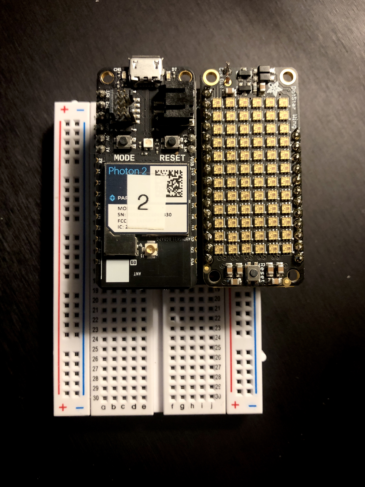
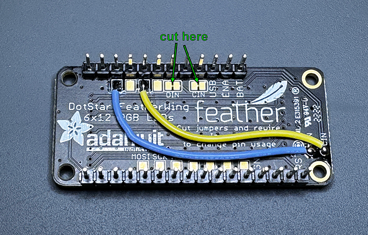

## DotStar FeatherWing RGB Matrix

*Wire up a DotStar FeatherWing Matrix board, exposing a graphics library for a 12 x 6 RGB LED matrix*

---

### Introduction 

The DotStar FeatherWing matrix can be connected to the Photon2 via a FeatherWing Doubler.  Details included below.

#### This project series demonstrates the following:

1. how to write code with the "Device OS" Particle.io operating system (microcontroller-based) that pushes commands out via the SPI bus to an LED controller board.
1. how to connect DotStar Matrix component, a FeatherWing Doubler, and your Photon2 microcontroller together
1. how to configure your DotStar Matrix board for use with a Photon2
1. how to engage with the various modalities of the Adafruit GFX library, along with some special matrix functions that the DotStar library offers.

---

### Overview: 

The matrix is powered over 3.3V from the microcontroller, which can be supplied via a usb power adapter, a lipo battery, or your computer's usb port.  There are a couple of things we'll need to do before getting started.

---

### Prepare your hardware for the demos

**DotStar FeatherWing Modifications**

To use the DotStar Matrix, you'll need to some modifications:

- using an X-acto knife, carefully cut 
	- the trace between the two DIN pads
	- the trace between the two CIN pads
- solder a jumper wire from the rightmost CIN pad and the 3rd pad from the top-left (D4)
- solder a jumper wire from the rightmost DIN pad and the 1st pad from the top-left (D2)

*Modifications of the DotStar board*

**FeatherWing Doubler Connections**

1. The connections for this project rely on a FeatherWing doubler, which can be found [here](https://www.adafruit.com/product/2890).  These boards allow the FeatherWing to be connected pin-for-pin with the Photon2.
1. Solder a set of long female headers on to the FeatherWing, such that it can be inserted into a breadboard.  Be mindful of the orientation and arrange the pieces into a test fitting before committing and soldering all the pins.  This orientation will allow you to continue to use many of the Photon2's pins while the SPI communication is active.

**Photon connections**

1. connect your Photon2 to the doubler
1. connect your Photon2 to the computer with a usb cable 

<h5>...Assembly</h5></img>

---

### Steps to replicate software environment

**Note:** *We assume that you have installed Particle Workbench inside of Visual Studio Code, and are familiar with the process of selecting your device.*  If not, see [this tutorial](https://github.com/Berkeley-MDes/tdf-fa23-equilet/blob/main/_pw_tutorial/README.md).

1. open the folder this README resides within in Visual Studio Code
1. select your particle device OS
1. select your particle device type
1. leave the device name/id blank for most cases
1. verify/compile
1. flash the code to your photon2 

#### Code Overview:

There are 5 examples to get you started with the DotStar board.  Each of these explore different concepts as they relate to the topics of RGB leds, matrices, graphics libraries, color fading, etc.  Your own project will likely involve a combination of these techniques, each of which are included for perusal.  There is no "right way" to engage with this platform, but some best practices and gotchas to be careful about.  Pay special attention to the fact that SPI1 is in use, which corresponds to the jumper setup described above.  

**Examples**

- `dotstar_fader`: basic fading using a single RGB pixel...  Does not blend colors
- `dotstar_bitshifting`: RGB fading using bitshifting; fades between noise field and a muted green
- `dotstar_rainbow`: demonstrates usage of a rainbow fading/scanning utility
- `dotstar_textoutput`: print text with individual control over colors for each character
- `dotstar_voronoi`: generate voronoi noise fields with various color schemes 

---

### To use/test

1. Open an example folder
1. Flash the Photon2 with the code, and view
1. **Note**: some of these examples demand processing power from the Photon2.  If your microcontroller is running at a very fast rate, it may not respond to requests from the Particle Workbench to initiate DFU mode and accept a flash.  If this is the case, the easiest way I've found is to do a hard reset with the reset button and issue the flash right after, forcing it.
1. It may be useful to place some sort of diffuser (even a sheet of white paper will do) to scatter the light so that the matrix is not too bright to view