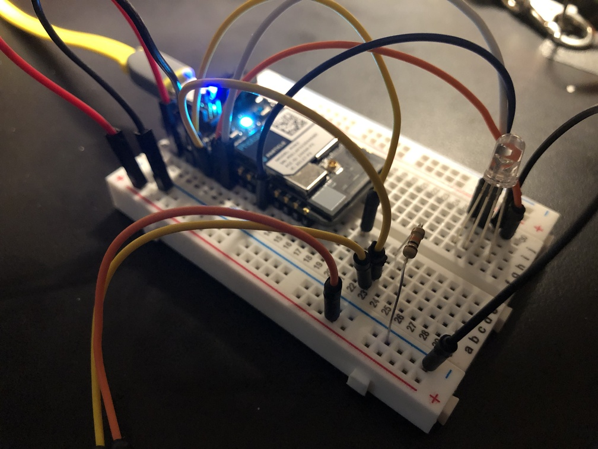
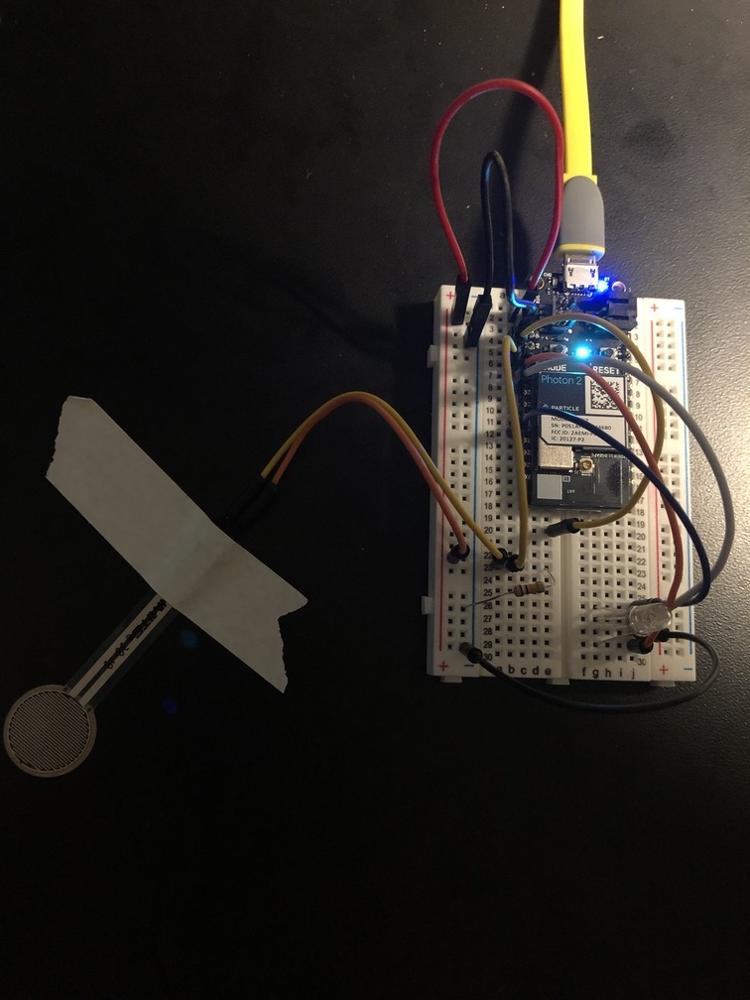

## fsr (force sensitive resistor) -> RGB-led color fader



---

### Goal of Project 

*Continuous pressure onto the FSR will yield fading to a particular color combination on the RGB led, via PWM fading*

We will use some standard components to perform this exercise.  The action of you pushing into the FSR will alter a variable in the code running on the microcontroller, which will in turn change which RGB colors are output over time.  This is accomplished via a `switch()` statement, with a very fast (small number of milliseconds) fading time for the PWM.  Not all pins can output PWM, so we'll choose our pins for i/o carefully.  Refer to the [Photon 2 pin marking diagram](https://docs.particle.io/reference/datasheets/wi-fi/photon-2-datasheet/#pin-markings) located in the [photon 2 datasheet](https://docs.particle.io/reference/datasheets/wi-fi/photon-2-datasheet/) page on the [Particle.io reference](https://docs.particle.io/reference/) website.  We'll use a resistor for the measured FSR pin to GND.

#### This project demonstrates the following:

1. how to write code with the "Device OS" Particle.io operating system (microcontroller-based) that takes input, processes it, and passes the processed data to an output to yield actuation
1. how to connect an RGB LED component, an FSR component, and your photon2 microcontroller together via a breadboard with leads.  
1. how to use a custom function within DeviceOS, and explore delaying the execution of this function within the scope of it's call stack.

---

### Documentation: 

The circuit is powered over 3.3V from the microcontroller, which can be supplied via a usb power adapter, a lipo battery, or your computer's usb port.

fsr/led top | fsr/led fritzing
---|---
 | 

### Steps to recreate circuit:

Photon connections:

1. push your Photon 2's pins into a mini (or regular) breadboard so that it straddles the two sides.  **Note** that one of the sides will have more pins left on the relevant rails than the other.  This is fine.  Also **note** that if you position the device towards the top of the board it's easier to plug in the micro-USB cable.  
1. connect a lead from the 3.3V pin of the photon 2 to the +3.3V (red) rail of your breadboard
1. connect a lead from the GND pin of the photon 2 to the GND (blue) rail of your breadboard

FSR connections: 

1. connect the "left" lead (see diagram) of the FSR to a middle rail of your breadboard
1. connect a lead from this same rail to the A1 input on the photon2
1. connect a leg of a _ resistor to an open terminal of this same rail 
1. connect the other leg of the _ resistor to the GND rail
1. connect the "right" lead (see diagram) of the FSR to the +3.3V rail

RGB LED connections (assumes common cathode):

1. connect all 4 legs of the RGB led to some open rails on the breadboard
1. connect a lead from the COMMON cathode leg (longest) rail to the GND rail
1. connect a lead from the RED leg rail to a terminal touching the A2 pin of your photon2
1. connect a lead from the GREEN leg rail to a terminal touching the A5 pin of your photon2
2. connect a lead from the BLUE leg rail to a terminal touching the MO pin of your photon2

---

### Steps to replicate software environment

**Note:** *We assume that you have installed Particle Workbench inside of Visual Studio Code, and are familiar with the process of selecting your device.*  If not, see [this tutorial](https://github.com/Berkeley-MDes/tdf-fa24-equilet/blob/main/_tutorials/installation_compilation/p2_pw_tutorial/README.md).

1. open the folder this README resides within in Visual Studio Code
1. select your particle device OS
1. select your particle device type
1. select your particle photon 2 device either by device name or ID
1. verify/compile
1. flash the code to your photon2 

#### Code (represented in project):

```
SYSTEM_THREAD(ENABLED);

const int REDPIN = D13;
const int GREENPIN = D14;
const int BLUEPIN = D15;
const int FSRPIN = A1;
const int deltime = 2;

int rValue = 0;
int gValue = 0;
int bValue = 0;
 
void setup() {
  //digital output
  pinMode(REDPIN, OUTPUT);
  pinMode(GREENPIN, OUTPUT);
  pinMode(BLUEPIN, OUTPUT);
  //analog input
  pinMode(FSRPIN, INPUT); 
}
 
void loop() {
  int fsr = analogRead(FSRPIN);
  
  switch(fsr){
    case 10 ... 682:
      setTarget(255, 0, 255); // Magenta
      break;
    case 683 ... 1365:
      setTarget(0, 255, 0);   // Green
      break;
    case 1366 ... 2048:
      setTarget(0, 0, 255);   // Blue
      break;
    case 2049 ... 2731:
      setTarget(255, 255, 0); // Yellow
      break;
    case 2732 ... 3414:
      setTarget(255, 0, 0);   // Red
      break;
    case 3415 ... 4095:
      setTarget(0, 255, 255); // Aqua
      break;

    default:
      setTarget(0, 0, 0); // dimmed
      break;
  }
}
 
void setTarget(int red, int green, int blue) {
  while ( rValue != red || gValue != green || bValue != blue ) {
    if ( rValue < red ) {rValue += 1;}
    if ( rValue > red ) {rValue -= 1;}
 
    if ( gValue < green ) {gValue += 1;}
    if ( gValue > green ) {gValue -= 1;}
 
    if ( bValue < blue ) {bValue += 1;}
    if ( bValue > blue ) {bValue -= 1;}
 
    setColor(rValue, gValue, bValue);
    delay(deltime);
  }
}
 
void setColor(int R, int G, int B) {
  analogWrite(REDPIN, R);
  analogWrite(GREENPIN, G);
  analogWrite(BLUEPIN, B);
}
```

---

### To use/test

1. Apply continuous pressure to the FSR
1. Notice the RGB LEDs changing in various ways that correspond to the amount of pressure applied
