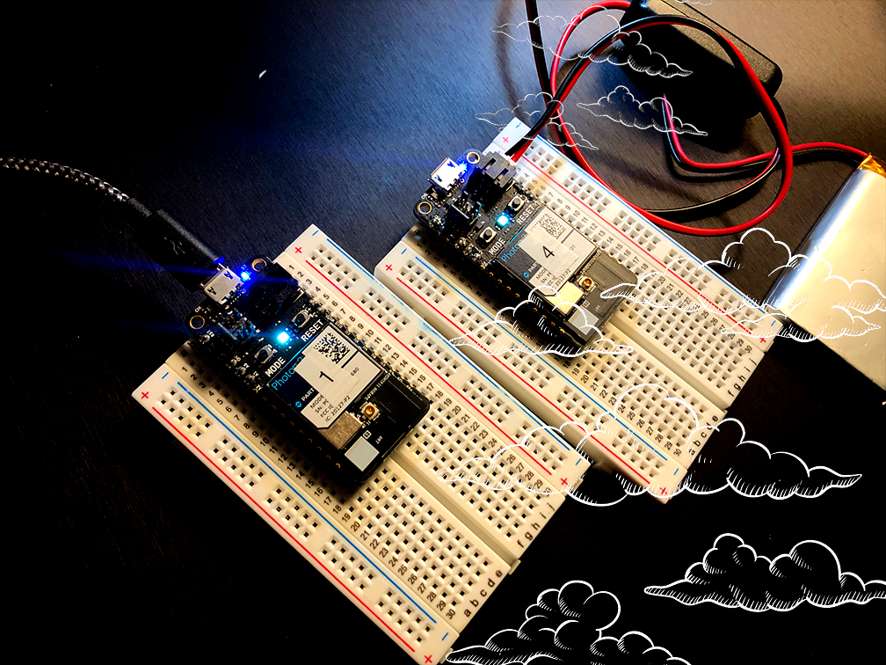
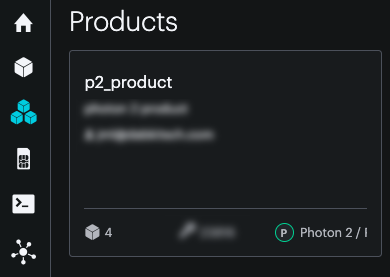

# Publish/Subscribe

A Particle Workbench project showcasing Particle.io's publish/subscribe cloud-based model



## Table of Contents
- [Introduction](#intro)
- [Particle Configuration: Same Account](#config.same)
- [Particle Configuration: Different Accounts](#config.diff)
- [Photon2 Pub/Sub Configuration](#ref)
- [Steps to recreate demo](#steps)
- [Code Overview](#code)

---

<a name="intro"></a>
### Introduction 

*Publish a Photon2's value (to the cloud), and subscribe to it with another Photon2.*

This is an exercise in enabling cloud communication between two microcontrollers via a Publish/Subscribe model.

The Particle.io [Device OS](https://www.particle.io/platform/device-os/) offers a number of cloud functions.  This example shows you how to use 2 microcontrollers to pass data through the cloud.  A "subscriber" microcontroller can pick up on a signal when it is a part of a product, either via a subscription or what is called a "particle variable".  A subscription will output data to your microcontroller when notified of an update (webhook).  A variable is a value in the cloud which is waiting to be accessed by another process (request).

We'll get started with the Particle console setup, and move to details involving the devices and firmware code.

---

### Particle.io console configuration:

<a name="config.same"></a>
**Same account:**

If you are subscribing to a device that is registered on your own account, the steps to make sure your published value can be seen by another `Photon2` are

- navigate to [https://console.particle.io](https://console.particle.io/products).  You may have a product here already.

Either 

- make a product...


- ...or, select a product (click on the name), which brings you to the "product context" of the console



- select devices (within the product context, which is different from the "*home*" context)


- add your `photon2` to the product [add devices]


<a name="config.diff"></a>
**Different accounts:**

If you are subscribing to a device that is **not** localized to your personal account (i.e, a classmate's or friend's), you will need to utilize a Particle.io team.  This is a multi-step process in which a product "owner" needs to associate other Particle.io users with a team.  Here is a diagram of what this looks like with respect to the nesting of elements (note that although groups are represented here you can forget about them for the moment):


...With that in mind, here are the steps to invite a team member and make sure it's located within the relevant product:

- make a product (skip if you've already got one).  
  - go to [the particle console](https://console.particle.io/products), 
  and click [new product](https://console.particle.io/products/new) 
  <div><br></div>
    - enter a name
    - give a description if applicable
    - in the device-type pulldown menu, select _Photon 2 / P2 (Wi-Fi)_

- select the product by name (the sidebar is reconfigured to show options for product configuration)
<div></img></div>

- select devices <div></img></div>
- add your `photon2` to the product [add devices], 
<div></img></div>
- then [add one device]
<div></img></div>
- nav to team within the product 
<div></img></div>
- invite the person via email to your team 
<div></img></div>

---

<a name="ref"></a>
### Photon2 Configuration: 

The subscribing Photon2 is powered over 3.3V from the microcontroller, which is supplied by your computer's usb port.  This is so that we can log info to the serial console directly.  The publishing Photon2 can be powered however you like.

Publisher (note the ID) | Subscriber (note the ID)
---|---
 | 

<a name="steps"></a>
### Steps involving hardware:

Photon connections (for the publishing unit):

- push your Photon2s' pins into a mini (or regular) breadboard so that it straddles the two sides.  **Note** that one of the sides will have more pins left on the relevant rails than the other.  This is fine.  Also **note** that if you position the device towards the top of the board it's easier to plug in the micro-USB cable.  For this particular tutorial, we mainly do this to make sure the pins aren't exposed (avoiding a short).
- you may want to connect a Li-Po battery to the publishing Photon2 unit if you don't have a spare USB port to power it with.

---

### Steps to replicate software environment

**Note:** *We assume that you have installed Particle Workbench inside of Visual Studio Code, and are familiar with the process of selecting your device.*  If not, see [this tutorial](https://github.com/Berkeley-MDes/tdf-fa24-equilet/blob/main/_tutorials/installation_compilation/p2_pw_tutorial/README.md).

1. In Visual Studio Code, open either the publish or subscribe project folder
1. select your particle device OS
1. select your particle device type
1. select your particle photon 2 device either by device name or ID
1. verify/compile
1. flash the code to your `photon2` 

<a name="code"></a>
#### Code (publish project):

```
#include "Particle.h"

SYSTEM_MODE(AUTOMATIC);
SYSTEM_THREAD(ENABLED);
SerialLogHandler logHandler(LOG_LEVEL_INFO);

//a global value to publish either via Particle.publish() or Particle.variable()
int random_value = 0;

void setup() {
  //this is an option for "exposing" a cloud variable
  //https://docs.particle.io/reference/device-os/api/cloud-functions/particle-variable/
  //Particle.variable("random_value", random_value);
}

void loop() {
    
    //note: if you are using Particle.variable(), this value can be updated as frequently as you like without a
    //data operation being counted.  It is only when you _access_ the variable online
    //that you are charged.  So another timer elsewhere on the web could access this variable
    //at a given polling interval, for example.
    random_value = random(0, 255);

    //Particle.publish() is another way to publish the value.  Note that each publish call will 
    //incur a data operation and that you only have so many of those in 
    //your free particle account.
    //https://docs.particle.io/reference/device-os/api/cloud-functions/particle-publish/
    Particle.publish("random_value", String(random_value), PRIVATE);

    //The subscriber code can be found in the same directory as this project's parent folder
    //it is called "subscribe_code"

    //Log.info("the published value: %d\n", random_value);
    delay(10000);
    //delay(500);
}
```
#### Code (subscribe project):

```
#include "Particle.h"

SYSTEM_MODE(AUTOMATIC);
SYSTEM_THREAD(ENABLED);
SerialLogHandler logHandler(LOG_LEVEL_INFO);

//function prototype
void value_handler(const char *event, const char *data);
//vars
double floatval = 0.0;

// setup() runs once, when the device is first turned on.
void setup() {
  //https://docs.particle.io/reference/device-os/api/cloud-functions/particle-subscribe/
  Particle.subscribe("random_value", value_handler);
}

//note that we are not doing anything in the loop
//this is because we are using the subscribe function to listen for events, 
//and the handler function to process the data
void loop() {
}

void value_handler(const char *event, const char *data){
  float myvalue = (float)(atof(data));
  //view in serial monitor
  Log.info("received an event -----------------------------");
  Log.info("the raw data (string): %s\n", data);
  Log.info("the converted value: %f\n", myvalue); 
}
```

---

### To use/test

1. Turn both devices on (making sure that the subscriber is connected to your computer via USB)
1. Look in the serial monitor for values that are captured over the cloud!
  - make sure you've selected a port in the serial monitor window 
  - enabling monitoring 
