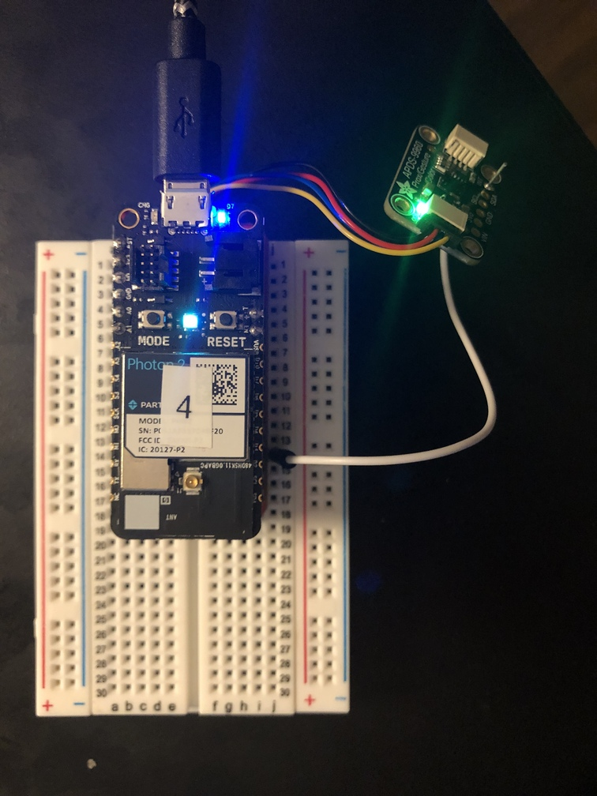

## Stemma-QT series: APDS9960


---

### Goal of Project 

*Connect an APDS9960 unit to the `Photon 2` via a [Stemma QT interfacing board](https://www.adafruit.com/product/4515).  Print the values from the proximity, ambient color, and gesture direction to the serial port.*

This tutorial will assist you in the acquisition of data from the [Adafruit APDS9960](https://www.adafruit.com/product/3595) sensor board.  The demo code prints data to the serial port, and demonstrates what sort of variables to initialize, which function calls to use, etc.  Because there are 3 separate functions in this sensor board, there are different ways to access them (and different methods amongst different libraries), so we provide 4 separate project files to avoid ambiguity in the implementations.

The libraries that these projects use are: 

- `SparkFun_APDS-9960_Sensor_Arduino_Library` 
- `Adafruit_APDS9960_Particle`

...In newly created projects, you can include them manually by going into the command palette of VS Code and typing **Particle: Install Library**, then entering in `<library name>` when prompted.  For your convenience, full projects have been provided so that you do not have to generate your own.  See below:

**Examples group 1:** `SparkFun_APDS-9960_Sensor_Arduino_Library`:

- **APDS9960_color**: reads color without interrupt pin
  - this example displays color periodically based on the duration of the `loop()`.
- **APDS9960_prox**: reads proximity without interrupt pin
  - this example displays proximity at a relatively fast rate, and utilizes polling

**Examples group 2:** `Adafruit_APDS9960_Particle`:

- **APDS9960_gesture-ada**: reads gestures without interrupt pin
  - this example displays gestures when they occur (up, down, left, right)
  - hold your hand open around 6 inches from the device to activate
- **APDS9960_prox-ada**: reads proximity utilizing interrupt pin
  - this example reads proximity when thresholds of delta movement are detected.  
  - you can consider the output of this "bursty" with temporally high resolution data happening at critical moments.
  - it requires that you connect the stemma board's interrupt pin to pin D2 of the microcontroller.

#### This project series demonstrates the following:

1. write firmware code with the Particle.io "Device OS" that takes input from a multi-sensor, processes it, and passes the processed data to the serial port
1. connect an APDS9960 board to a `Photon 2` via the [Stemma QT interfacing board](https://www.adafruit.com/product/4515)
1. use custom functions within DeviceOS
1. pass in addresses of variables to be set by a function in Wiring/C/C++
1. utilize an interrupt function (with an associated external pin) from a sensor board to enable a portion of our code to fire

---

### Documentation: 

The circuit is powered over 3.3V from the microcontroller, which can be supplied via a usb power adapter, a lipo battery, or your computer's usb port.

apds top | apds top no-pin
---|---
 | 

### Steps to recreate circuit:

Preparation:

- Solder the Stemma QT interfacing board, as described [here](https://www.youtube.com/watch?v=DHG7GmUL8wM&ab_channel=loopstick)
- Fit your `Photon 2`'s male headers over the Stemma QT interfacing board's female headers.

Photon connection:

- Plug the `Photon 2` into the Stemma-QT interfacing board
- Make sure that the pins match with respect to orientation!

Stemma-QT connection:

- Plug the 4-pin JST cable into one of the 4-pin male ports
- Make sure that the black wire is on the left

Sensor connection:

- Plug the sensor's 4-pin JST connector into the Stemma QT interfacing board.  
- Make sure that the black cable is near the "on" label
- Optional:  If using one of the interrupt-based examples, make sure to wire the interrupt pin from the APDS9960 to the Photon2's D2 pin

---

### Steps to replicate software environment

**Note:** *We assume that you have installed Particle Workbench inside of Visual Studio Code, and are familiar with the process of selecting your device.*  If not, see [this tutorial](https://github.com/Berkeley-MDes/tdf-fa24-equilet/blob/main/_tutorials/installation_compilation/p2_pw_tutorial/README.md).

1. open the folder this README resides within in Visual Studio Code
1. bring up the command palette with `⇧⌃P (Windows, Linux) | ⇧⌘P (macOS)` 
1. type `>Particle: Configure Project for Device`, and hit `enter`
1. verify/compile
1. flash the code to your `Photon2` 

#### Example Code (see relevant project for full details):

```
//This sketch puts the sensor in proximity mode and enables the interrupt
//to fire when proximity goes over a set value

// Include Particle Device OS library
#include "Particle.h"

SYSTEM_MODE(AUTOMATIC);
SYSTEM_THREAD(ENABLED);
SerialLogHandler logHandler(LOG_LEVEL_INFO);
#include "Adafruit_APDS9960_Particle.h"

//the pin that the interrupt is attached to
pin_t interrupt_pin = D2;

//create the APDS9960 object
Adafruit_APDS9960 apds;

void setup() {
  Serial.begin(115200);
  pinMode(interrupt_pin, INPUT_PULLUP);

  if(!apds.begin()){
    Serial.println("failed to initialize device! Please check your wiring.");
  }
  else Serial.println("Device initialized!");

  //enable proximity mode
  apds.enableProximity(true);
  //set the interrupt threshold to fire when proximity reading goes above 175
  apds.setProximityInterruptThreshold(0, 175);
  //enable the proximity interrupt
  apds.enableProximityInterrupt();
}

void loop() {

  //print the proximity reading when the interrupt pin goes low
  if(!digitalRead(interrupt_pin)){
    Serial.println(apds.readProximity());

    //clear the interrupt
    apds.clearInterrupt();
  }
}
```

---

### To use/test

1. Open, compile, and flash as described above
1. Once the project is on the Photon 2, proceed
1. Move the accelerometer around in the air
1. View values sent to the serial port by opening up a monitor in the Particle Workbench and selecting your port, then clicking on `Start Monitoring`
1. Try pressing the button to see values get mapped and printed in a more readable format to the serial port
