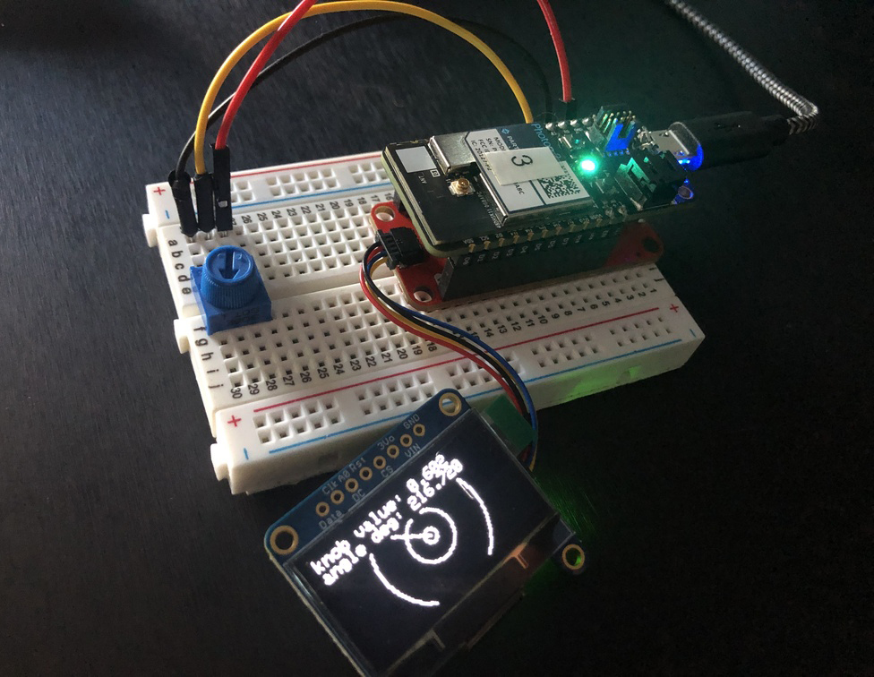
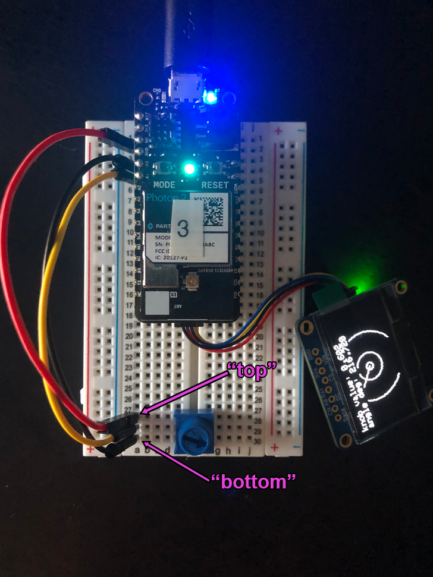

## potentiometer -> oled display


*Note the stemma-QT interfacing board, and 4-pin JST cable*

## Table of Contents
- [Goal of project](#goal)
- [Hook-up instructions](#hookup)
- [Steps to recreate the circuit](#steps-circuit)
- [Steps to recreate the software environment](#steps-software)
- [Code](#code)
- [Usage](#usage)

---

<a name="goal"></a>
### Goal of Project 

*Display the value of a potentiometer on an OLED screen via the I2C bus on a Photon2*

This is an exercise in converting a raw analog voltage into human-readable text and graphics.  There are a few interesting tidbits along the way to pay attention to, including defining a custom function in Particle Workbench, utilizing a byte array for the display of a splash screen, and working with a variable (unknown) delay time for a particular piece of hardware (the oled).  We'll do a quick test in the `setup()` function to ascertain whether or not our OLED is functioning before we attempt to draw pixel data to it.  The two libraries you'll include in the project are `Adafruit_SSD1306_RK` and `Adafruit_GFX.h` (which is an auto-generated dependency), the latter of which will aid in drawing text, shapes, and bitmaps.

#### This project demonstrates the following:

1. how to write code with the "Device OS" Particle.io operating system (microcontroller-based) that takes input, processes it, and passes the processed data to an output to yield actuation
1. how to connect a Monochrome 1.3" 128x64 OLED graphic display to our photon2 via a 4-pin JST stemma-QT cable (you can optionally connect a 4-pin breakout cable) and a stemma-QT interfacing board
1. how to use custom functions within DeviceOS
1. how to work with scheduled delays to perform desired outcomes
1. an intro to the `map()` function
1. type-casting in Wiring/C/C++
1. calling a library's primary object methods
1. nested for loops for drawing code

---

<a name="hookup"></a>
### Hook-up Instructions: 

The circuit is powered over 3.3V from the microcontroller, which can be supplied via a usb power adapter, a lipo battery, or your computer's usb port.

<div align="center"></div>

<a name="steps-circuit"></a>
### Steps to recreate circuit:

**Photon connections:**

- push the stemma-QT interfacing board into a mini breadboard so that it straddles the two sides.  **Note** that one of the sides will have more pins left on the relevant rails than the other.  This is fine.  Also **note** that if you position the device towards the top of the board it's easier to plug in the micro-USB cable.  

- push your Photon 2's pins into the stemma-QT interfacing board, making sure that the pins align with respect to orientation. 

- connect the Photon 2 to your computer via a micro-usb -> cable (typically either type-a or type-c on the computer end)

**OLED connections:**

1. connect the OLED to the stemma-QT interfacing board via a 4-pin JST cable

1. be mindful of the orientation of the cable on both sides.  Note that the yellow wire should be "on the right" when looking at the stemma-QT interfacing board from the top, and that the yellow wire will be closest to the label "on" when connecting to the OLED board.

**Potentiometer connections:**

1. connect the top pin (see [detail](#hookup)) of the potentiometer to the 3.3V pin of the photon2
1. connect the middle pin of the potentiometer to the first analog pin of the photon2 (A0)
1. connect the bottom pin (see [detail](#hookup)) of the potentiometer to the GND pin of the photon2

---

<a name="steps-software"></a>
### Steps to replicate software environment

**Note:** *We assume that you have installed Particle Workbench inside of Visual Studio Code, and are familiar with the process of selecting your device.*  If not, see [this tutorial](https://github.com/Berkeley-MDes/tdf-fa23-equilet/blob/main/_pw_tutorial/README.md).

1. open the folder this README resides within in Visual Studio Code
1. bring up the command palette with `⇧⌃P (Windows, Linux) | ⇧⌘P (macOS)` 
1. type `>Particle: Configure Project for Device`, and hit `enter`
1. verify/compile
1. flash the code to your photon2 

<a name="code"></a>
#### Code (represented in project):

```
#include "Particle.h"
#include "Adafruit_SSD1306.h"
#include "Adafruit_GFX.h"
#include "splash.h" //this is our custom header containing the splash screen bitmap

#define SCREEN_WIDTH 128 // OLED display width, in pixels
#define SCREEN_HEIGHT 64 // OLED display height, in pixels
#define SCREEN_ADDRESS 0x3D // OLED display address (for the 128x64)
#define POT_PIN A0 // Potentiometer is connected to A0

SYSTEM_MODE(AUTOMATIC);
SYSTEM_THREAD(ENABLED);
SerialLogHandler logHandler(LOG_LEVEL_INFO);

Adafruit_SSD1306 disp(SCREEN_WIDTH, SCREEN_HEIGHT, &Wire, -1);

//function prototypes
void draw_splash(void); //our splash screen function
void draw_bitmap(const unsigned char* bitmap, int x, int y, int w, int h, int color);
float draw_potval(float val); //our potentiometer value display function

int potval = 0;

void setup() {
  
  delay(8); 
  bool test_access = disp.begin(SSD1306_SWITCHCAPVCC, SCREEN_ADDRESS);

  if(!test_access){
    Log.info("SSD1306 allocation failed");
    return;
  }else{
    Log.info("SSD1306 allocation success");
    draw_splash();
    delay(2000);
  }
}

void loop() {
  int potval = map(analogRead(POT_PIN), 4095, 0, 0, 1000);
  float potval_float = (float)potval / 1000.0;
  Log.info("potval: %f", potval_float);
  draw_potval(potval_float);

  delay(100); // Pause for a moment
}

void draw_splash(void) {
  disp.clearDisplay();
  disp.drawBitmap(0, 0, epd_pirate_small, SCREEN_WIDTH, SCREEN_HEIGHT, WHITE);
  disp.display();
}

float draw_potval(float val) {

  float radians = val * 2 * PI;
  float circle_radius1 = 64.0 * val;
  float circle_radius2 = circle_radius1 * 0.4;
  float circle_radius3 = circle_radius1 * 0.125;;
  int16_t x = 64;
  int16_t y = 32;
  int16_t r_outer = int16_t(circle_radius1);
  int16_t r_inner1 = int16_t(circle_radius2);
  int16_t r_inner2 = int16_t(circle_radius3);
  disp.clearDisplay();
  disp.drawCircle(x, y, r_outer, WHITE);
  disp.drawCircle(x, y, r_inner1, WHITE);
  disp.drawCircle(x, y, r_inner2, WHITE);
  int16_t x2 = x + cos(radians) * r_outer;
  int16_t y2 = y + sin(radians) * r_outer;
  disp.drawLine(x, y, x2, y2, WHITE);
  disp.fillRect(0, 0, SCREEN_WIDTH, 18, BLACK); 
  disp.setTextSize(1);
  disp.setTextColor(WHITE);
  disp.setCursor(0,0);
  disp.println("knob value: " + String(val, 3));
  disp.println("angle deg: " + String(radians * (180.0 / PI), 3));
  disp.display();
  
  return val;
}

void draw_bitmap(const unsigned char* bitmap, int x, int y, int w, int h, int color) {
  int byte_width = (w + 7) / 8;
  for (int j = 0; j < h; j++) {
    for (int i = 0; i < w; i++ ) {
      if (pgm_read_byte(bitmap + j * byte_width + i / 8) & (128 >> (i & 7))) {
        disp.drawPixel(x + i, y + j, color);
      }
    }
  }
}
```

---

<a name="usage"></a>
### To use/test

1. Turn the knob
1. Look at the OLED screen:  it should read `potentiometer value: <x>` and display an angle in degrees, alongside some graphics.
