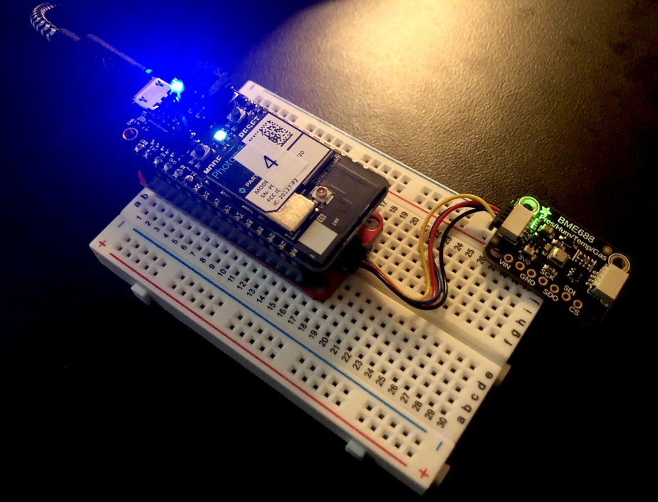
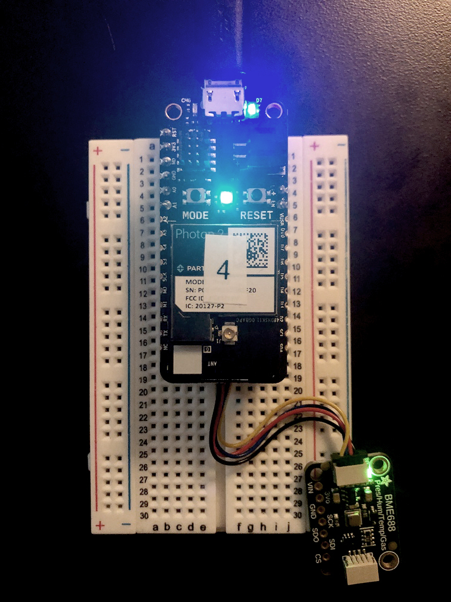

## Stemma-QT series: pressure/humidity/temp/gas



---

### Goal of Project 

*Connect an BME688 unit to the `Photon 2` via a [Stemma QT interfacing board](https://www.adafruit.com/product/4515).  Print the values of pressure, humidity, temp, and gas to the serial port.*

This tutorial will assist you in the acquisition of data from the [Adafruit BME688](https://www.adafruit.com/product/5046) sensor board.  The demo code prints data to the serial port via the `Log.info()` method, and demonstrates what sort of variables to initialize, which function calls to use, etc.  The library that this project uses is called **Adafruit_BME680**.  You can include it manually by going into the command palette of VS Code and typing `Particle: Install Library`, then entering in `Adafruit_BME680` when prompted.

#### This project demonstrates the following:

1. write firmware code with the Particle.io "Device OS" that takes input, processes it, and prints the processed data to the serial port
1. how to connect an BME688 board to a `Photon 2` via the [Stemma QT interfacing board](https://www.adafruit.com/product/4515)
1. how to set the sensor board up for a particular use case
1. how to acquire sensor values from the board via the BME680 lib

---

### Documentation: 

The circuit is powered over 3.3V from the microcontroller, which can be supplied via a usb power adapter, a lipo battery, or your computer's usb port.

BME688 top |
--- | 
 |

### Steps to recreate circuit:

Preparation:

- Solder the Stemma QT interfacing board, as described [here](https://www.youtube.com/watch?v=DHG7GmUL8wM&ab_channel=loopstick)

Photon connection:

- Plug the `Photon 2` into the Stemma-QT interfacing board
- Make sure that the pins match with respect to orientation

Stemma-QT connection:

- Plug the 4-pin JST cable into one of the 4-pin male ports
- Make sure that the black wire is on the left

Sensor connection:

- Plug the sensor board's 4-pin JST connector into the Stemma QT interfacing board.  
- Make sure that the black cable is near the "on" label

---

### Steps to replicate software environment

**Note:** *We assume that you have installed Particle Workbench inside of Visual Studio Code, and are familiar with the process of selecting your device.*  If not, see [this tutorial](https://github.com/Berkeley-MDes/tdf-fa24-equilet/blob/main/_tutorials/installation_compilation/p2_pw_tutorial/README.md).

1. open the folder this README resides within in Visual Studio Code
1. bring up the command palette with `⇧⌃P (Windows, Linux) | ⇧⌘P (macOS)` 
1. type `>Particle: Configure Project for Device`, and hit `enter`
1. verify/compile
1. flash the code to your `Photon2` 

#### Code (from project):

```
// Include Particle Device OS APIs
#include "Particle.h"
#include "Adafruit_BME680.h"

#define BME_SCK 13
#define BME_MISO 12
#define BME_MOSI 11
#define BME_CS 10
#define SEALEVELPRESSURE_HPA (1013.25)

// Let Device OS manage the connection to the Particle Cloud
SYSTEM_MODE(AUTOMATIC);
// Run the application and system concurrently in separate threads
SYSTEM_THREAD(ENABLED);
SerialLogHandler logHandler(LOG_LEVEL_INFO);

Adafruit_BME680 bme; // I2C
//Adafruit_BME680 bme(BME_CS); // hardware SPI
//Adafruit_BME680 bme(BME_CS, BME_MOSI, BME_MISO,  BME_SCK);

double temperatureInC = 0;
double relativeHumidity = 0;
double pressureHpa = 0;
double gasResistanceKOhms = 0;
double approxAltitudeInM = 0;

void setup() {
  if (!bme.begin()) {
    Particle.publish("Log", "Could not find a valid BME680 sensor, check wiring!");
  } else {
    Particle.publish("Log", "bme.begin() success =)");
    // Set up oversampling and filter initialization
    bme.setTemperatureOversampling(BME680_OS_8X);
    bme.setHumidityOversampling(BME680_OS_2X);
    bme.setPressureOversampling(BME680_OS_4X);
    bme.setIIRFilterSize(BME680_FILTER_SIZE_3);
    bme.setGasHeater(320, 150); // 320*C for 150 ms
  }
}

void loop() {
  if (! bme.performReading()) {
    Log.info("Failed to perform reading :(");
  } else {
    temperatureInC = bme.temperature;
    relativeHumidity = bme.humidity;
    pressureHpa = bme.pressure / 100.0;
    gasResistanceKOhms = bme.gas_resistance / 1000.0;
    approxAltitudeInM = bme.readAltitude(SEALEVELPRESSURE_HPA);
    Log.info("Temperature: %.2f C, Humidity: %.2f %%, Pressure: %.2f hPa, Gas Resistance: %.2f kOhms, Altitude: %.2f m",
             temperatureInC, relativeHumidity, pressureHpa, gasResistanceKOhms, approxAltitudeInM);
  }
  delay(2000);
}
```

---

### To use/test

1. Open, compile, and flash as described above
1. Once the project is on the Photon 2, proceed
1. View values sent to the serial port (at 2 second intervals) by opening up a monitor in the Particle Workbench and selecting your port, then clicking on `Start Monitoring`