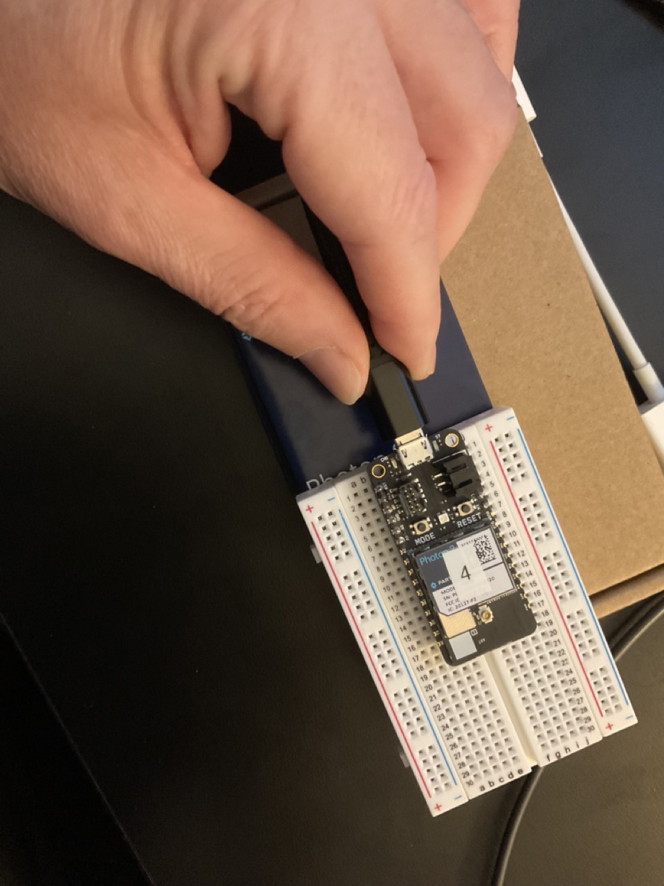

### Get your photon2 on the UC Campus IoT network

This tutorial assumes that you are attempting to get a `Photon 2` microcontroller on the IoT network to use for the MDes TDF course.  The goal is to obtain the Mac address of the device you are planning to use for your projects registered with campus IT so that it is recognized and validated.  The steps below will assist you in this process, and are to be performed in sequence.

#### Acquire Mac Address

1. connect the micro-usb plug to the photon2 

1. connect your photon2 to the computer via the USB port (either type-a or type-c depending on which cable you have see [here](https://www.viewsonic.com/library/tech/usb-c-usb-b-and-usb-a-whats-the-difference/))

1. open up vs code
1. inside of vs code, open a terminal window (Terminal -> New Terminal)
1. type `particle serial mac`
1. copy the contents that are returned in the terminal for the upcoming steps 

#### Register MAC Address with UC Berkeley for usage with IoT network

1. Log in to the UCB [wifi access portal](https://portal.berkeley.edu/people/wifi_access) (requires CalNet authentication)
1. Scroll down to "Berkeley-IoT Wi-Fi Network Devices" 

1. Click on "Manage devices"

1. Click on "Create New"

1. Enter the Mac Address that you copied (from the instructions above)
1. Give this device a name
1. Copy the password that is auto-generated (or generate a new one, and then copy) somewhere safe

#### Connect your Photon2 to the IoT network

1. Using a [Chrome Browser](https://www.google.com/chrome) window, navigate to [this link](https://docs.particle.io/tools/developer-tools/configure-wi-fi/)

1. enter your wifi credentials
  - Wi-Fi network name: `Berkeley-IoT`
  - Wi-Fi password: `<the IoT device password>`

Once you have completed this last step, return to the [main setup tutorial](https://github.com/Berkeley-MDes/tdf-fa23-equilet/blob/main/_pw_tutorial/README.md#particleio-account-setup) for next steps.
