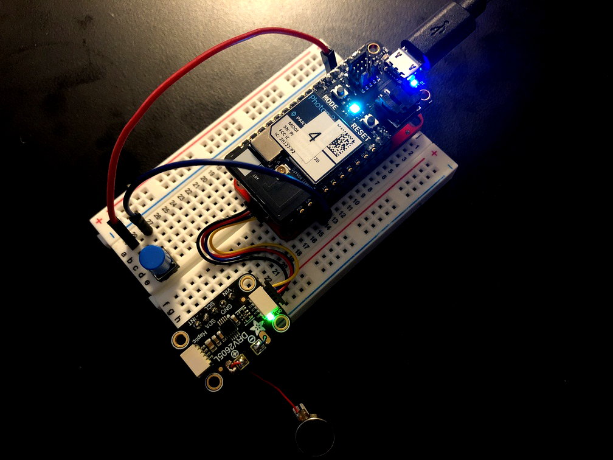
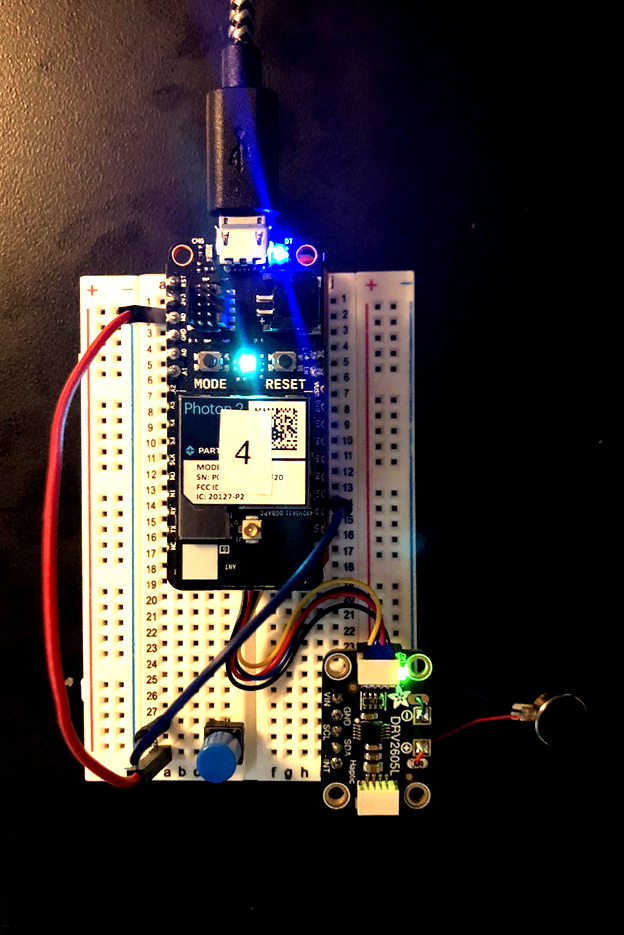
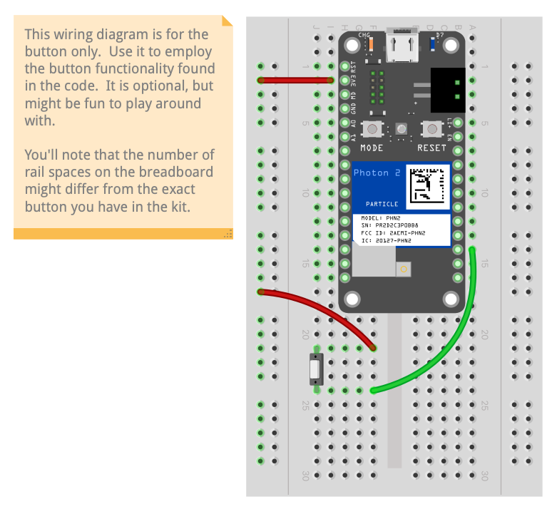

## Stemma-QT series: DRV2605L Haptic Motor Driver



---

### Goal of Project 

*Connect an DRV2605L unit to the `Photon 2` via a [Stemma QT interfacing board](https://www.adafruit.com/product/2305).  Cycle through the on-board options of haptic feedback types for evaluation, and utilize a button to disable/enable feedback.*

This tutorial will assist you in the acquisition of data from the [Adafruit DRV2605L](https://www.adafruit.com/product/3886) driver board.  The demo code prints the current vibration pattern to the serial port, as well as initiating the vibration pattern for the motor driver.  This processing results in variable voltage being applied to the motor over time.  The code demonstrates what sort of variables to initialize, which function calls to use, etc.  The library that this project uses is called `Adafruit_DRV2605_Library_Sahagun`.  You can include it manually by going into the command palette of VS Code and typing `Particle: Install Library`, then entering in `Adafruit_DRV2605_Library_Sahagun` when prompted.

#### This project demonstrates the following:

1. write firmware code with the Particle.io "Device OS" that takes input, processes it, and outputs a vibration pattern via a motor
1. connect an DRV2605L board to a `Photon 2` via the [Stemma QT interfacing board](https://www.adafruit.com/product/4515)
1. use imported library functions within DeviceOS
1. wire a button to our microcontroller
1. utilize an interrupt function to enable a portion of our code to run

---

### Documentation: 

The circuit is powered over 3.3V from the microcontroller, which can be supplied via a usb power adapter, a lipo battery, or your computer's usb port.

haptic motor top| button circuit fritzing
--- | ---
 |  

### Steps to recreate circuit:

Preparation:

- Solder the Stemma QT interfacing board, as described [here](https://www.youtube.com/watch?v=DHG7GmUL8wM&ab_channel=loopstick)

Photon connection:

- Plug the `Photon 2` into the Stemma-QT interfacing board
- Make sure that the pins match with respect to orientation

Stemma-QT connection:

- Plug the 4-pin JST cable into one of the 4-pin male ports
- Make sure that the black wire is on the left

Motor driver connection:

- Plug the motor driver's 4-pin JST connector into the Stemma QT interfacing board.  
- Make sure that the black cable is near the "on" label

Button connections:

- push a 2-leg button into two separate rails of a breadboard
- wire the "top" leg (refer to the image) to the 3.3V pin of the microcontroller
- wire the "bottom" leg to pin D2

---

### Steps to replicate software environment

**Note:** *We assume that you have installed Particle Workbench inside of Visual Studio Code, and are familiar with the process of selecting your device.*  If not, see [this tutorial](https://github.com/Berkeley-MDes/tdf-fa24-equilet/blob/main/_tutorials/installation_compilation/p2_pw_tutorial/README.md).

1. open the folder this README resides within in Visual Studio Code
1. prepare your Particle Workbench environment for flashing as described [here](https://github.com/Berkeley-MDes/24f-desinv-202/wiki/Particle-Workbench#setting-a-project-up).
1. verify/compile
1. flash the code to your photon2 

#### Code (from project):

```
// Include the necessary libraries
#include "Particle.h"
#include "MPU6050.h"
#define OUTPUT_READABLE_ACCELGYRO

// Let Device OS manage the connection to the Particle Cloud
SYSTEM_MODE(AUTOMATIC);
SYSTEM_THREAD(ENABLED);
SerialLogHandler logHandler(LOG_LEVEL_INFO);

const pin_t ledPin = D7;
const pin_t buttonPin = D2;

// MPU variables:
MPU6050 accelgyro;
int16_t ax, ay, az;
int16_t gx, gy, gz;

bool ledState = false;
bool buttonState = false;
int counter = 0;

void toggleLed();
void buttonHandler();

// this function just flips the state of the LED
// it makes it easier to see that the device is working
void toggleLed() {
    ledState = !ledState;
    digitalWrite(ledPin, ledState);
}

void buttonHandler() {
    buttonState = true;
}

// setup() runs once, when the device is first turned on
void setup() {
  
  interrupts();
  Serial.begin(38400);

  // initialize the LED pin as an output.
  pinMode(ledPin, OUTPUT);
  pinMode(buttonPin, INPUT_PULLDOWN);

  attachInterrupt(buttonPin, buttonHandler, RISING);

  // initialize device
  Serial.println("Initializing I2C devices...");
  Wire.begin(); // join I2C bus (I2Cdev library doesn't do this automatically)
  accelgyro.initialize();

  // verify connection
  Serial.println("Testing device connections...");
  Serial.println(accelgyro.testConnection() ? "MPU6050 connection successful" : "MPU6050 connection failed");
  pinMode(ledPin, OUTPUT);
}

// loop() runs over and over again, as quickly as it can execute.
void loop() {
  // read raw accel/gyro measurements from device
  accelgyro.getMotion6(&ax, &ay, &az, &gx, &gy, &gz);
 
  Serial.print("raw a/g:\t");
  Serial.print(ax); Serial.print("\t");
  Serial.print(ay); Serial.print("\t");
  Serial.print(az); Serial.print("\t");
  Serial.print(gx); Serial.print("\t");
  Serial.print(gy); Serial.print("\t");
  Serial.println(gz);

  // if the button was pressed, acquire & print the cooked values
  if(buttonState) {
    Serial.println("Button pressed");

    //map the values to a more legible range
    int vx = map(ax, -17000, 17000, -100, 100);
    int vy = map(ay, -17000, 17000, -100, 100);
    int vz = map(az, -17000, 17000, -100, 100);
    // display tab-separated (and mapped) accel x/y/z values
    Serial.print("cooked a:\t");
    Serial.print(vx); Serial.print("\t");
    Serial.print(vy); Serial.print("\t");
    Serial.println(vz);

    buttonState = false;
  }
  
  // toggle the LED every second
  toggleLed();
  delay(100);  //note that this delay is optional and mainly here to make the serial output easier to read
}
```

---

### To use/test

1. Open the project folder as described [here](https://github.com/Berkeley-MDes/24f-desinv-202/wiki/Particle-Workbench#open-an-existing-project-in-vs-code), and follow the subsequent steps to compile & flash
1. Once the project is on the Photon 2, proceed
1. Move the accelerometer around in the air
1. View values sent to the serial port by opening up a monitor in the Particle Workbench and selecting your port, then clicking on `Start Monitoring`
1. Try pressing the button to see values get mapped and printed in a more readable format to the serial port
